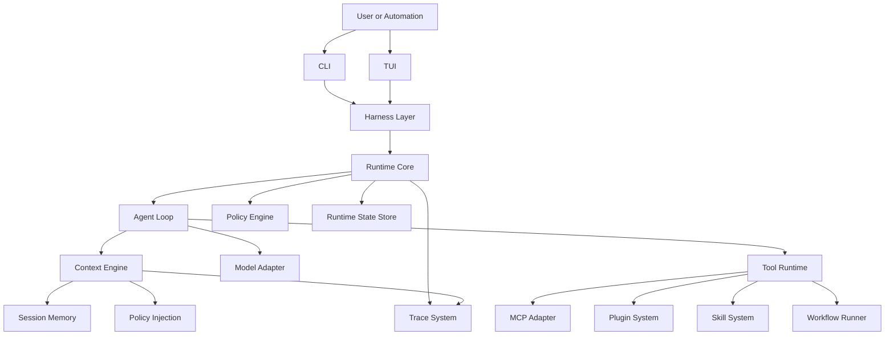

# ForgeOne

ForgeOne 是一个面向本地与服务端执行环境的开放式 Agent Runtime / Agent Harness。

它的目标不是构建一个对话机器人外壳，也不是在 LangGraph 之上封装一层工作流 DSL，而是提供一套可观测、可控、可扩展的运行时基础设施，用于承载 Coding Agent、工具编排与自动化执行。

ForgeOne 的核心定位：

- Open Agent Runtime
- Open Agent Harness
- Coding Agent Platform
- Transparent Context
- Controllable Execution
- Observable Agent Loop

ForgeOne 参考了 Codex CLI、Claude Code、OpenCode 这类本地优先的 Coding Agent 交互形态，但重点放在底层 Runtime 能力建设，而不是单一产品体验复刻。

## 项目简介

ForgeOne 面向如下场景：

- 本地代码仓库中的 Coding Agent 执行
- 可追踪的 Prompt / Context / Tool 调用流水
- 带权限控制、预算控制和沙箱策略的 Agent Loop
- 面向 MCP、Plugin、Skill、Workflow 的开放扩展
- 面向终端工作流的会话控制、确认门槛与 Trace 检查

ForgeOne 将 Agent 视为一个可检查、可重放、可限权的执行系统，而不是黑盒式聊天接口。

## Why ForgeOne

现有 Agent 工具在交互体验上已经证明了价值，但在基础设施层仍普遍存在几个问题：

- 上下文构建过程不可见，用户难以理解模型到底看到了什么
- Prompt 拼接链路不透明，系统提示、工具反馈、策略注入难以追踪
- Tool Call 结果分散，缺乏统一的执行日志、权限边界和失败语义
- Runtime State 变化缺少标准化观测面，难以调试长链路执行
- Agent Loop 停止条件、预算和最大循环次数往往是隐式实现
- CLI、Runtime、权限与审计信息经常散在不同层，难以形成统一控制面

ForgeOne 试图解决的不是“再造一个聊天界面”，而是把 Agent Runtime 本身做成一个开放、工程化、可替换的底座。

## Core Concepts

### Runtime

Runtime 是 ForgeOne 的核心执行内核，负责状态管理、模型请求、工具调用、策略执行和停止判断。

### Harness

Harness 是 Runtime 的承载外壳，负责连接 CLI、TUI、批处理任务、测试环境和远程执行器。Harness 不定义智能行为，只负责将输入、上下文、能力边界和观测面接到 Runtime。

### Context

Context 不是一段静态 prompt，而是由用户输入、仓库状态、历史轨迹、策略注入、工具观察结果共同构成的可追踪上下文快照。

### Tool

Tool 是 Runtime 统一调度的执行单元，包含本地命令、文件操作、MCP 能力、插件能力、技能能力以及更高层工作流。

### Trace

Trace 是对 Agent Loop 中每一次输入、上下文构建、模型请求、工具执行、状态更新和停止决策的结构化记录。

## Architecture



更详细的系统拆分见 [docs/architecture.md](/root/project/ai/forgeone/docs/architecture.md)。

## CLI Preview

以下示例包含当前已经落地的命令和仍在规划中的命令。

```bash
forgeone run "为当前仓库补充测试并解释改动"
forgeone run --max-loops 12 --budget-tokens 60000 "定位构建失败原因"
forgeone run --allow-tools read_file "检查 Runtime 状态流转"
forgeone run --approval-read-root crates/ "继续执行待确认工具调用"
forgeone trace list
forgeone trace show session_xxx
forgeone session list
forgeone approve session_xxx
forgeone resume session_xxx
```

CLI 的设计原则：

- 以任务驱动，而不是以聊天消息驱动
- 暴露 Runtime 配置，而不是隐藏 Runtime 行为
- 默认保留 Trace，而不是默认丢弃执行过程
- 将权限、沙箱、预算、循环次数作为一等参数

详见 [docs/cli-design.md](/root/project/ai/forgeone/docs/cli-design.md)。

## Roadmap

### Phase 0

- 定义 Runtime、Context、Tool 三类基础规格
- 完成 CLI 与 Trace 数据模型设计
- 建立插件、技能、MCP 三类扩展边界

### Phase 1

- 实现单会话 Agent Loop
- 支持文件系统、shell、补丁写入等基础工具
- 支持上下文构建追踪与 Tool Call 追踪

### Phase 2

- 支持可配置 Policy Engine
- 支持多模型适配层
- 支持 Plugin、Skill、Workflow 运行时注册
- 支持会话回放、断点恢复和失败重试

### Phase 3

- 支持 TUI、并行任务和远程执行器
- 支持多仓库上下文与跨仓库推理
- 支持可视化 Trace 检查与性能分析

完整路线图见 [docs/roadmap.md](/root/project/ai/forgeone/docs/roadmap.md)。

## 文档导航

- [docs/vision.md](/root/project/ai/forgeone/docs/vision.md)
- [docs/architecture.md](/root/project/ai/forgeone/docs/architecture.md)
- [docs/runtime.md](/root/project/ai/forgeone/docs/runtime.md)
- [docs/context-engine.md](/root/project/ai/forgeone/docs/context-engine.md)
- [docs/tool-runtime.md](/root/project/ai/forgeone/docs/tool-runtime.md)
- [docs/plugin-system.md](/root/project/ai/forgeone/docs/plugin-system.md)
- [docs/mcp-integration.md](/root/project/ai/forgeone/docs/mcp-integration.md)
- [docs/cli-design.md](/root/project/ai/forgeone/docs/cli-design.md)
- [docs/roadmap.md](/root/project/ai/forgeone/docs/roadmap.md)
- [specs/runtime-spec.md](/root/project/ai/forgeone/specs/runtime-spec.md)
- [specs/context-spec.md](/root/project/ai/forgeone/specs/context-spec.md)
- [specs/model-spec.md](/root/project/ai/forgeone/specs/model-spec.md)
- [specs/tool-spec.md](/root/project/ai/forgeone/specs/tool-spec.md)
- [specs/implementation-plan.md](/root/project/ai/forgeone/specs/implementation-plan.md)

## 当前状态

当前仓库已经具备最小可运行骨架，包含：

- 单 Agent 多轮 Agent Loop
- Context Engine / Model Adapter / Tool Runtime / Policy Engine / Trace System
- `read_file` 内建 Tool 与结构化 Observation
- `RequireApproval -> waiting_approval -> approve/resume` 会话控制链路
- `.forgeone/` 下的 session / trace 持久化，以及 `trace list/show/prune`、`session list/prune`

当前仍处于早期实现阶段，重点是把 Runtime、Context、Tool、Policy、Trace 的执行语义继续做实，并逐步补齐更完整的 CLI / TUI / 扩展面。
