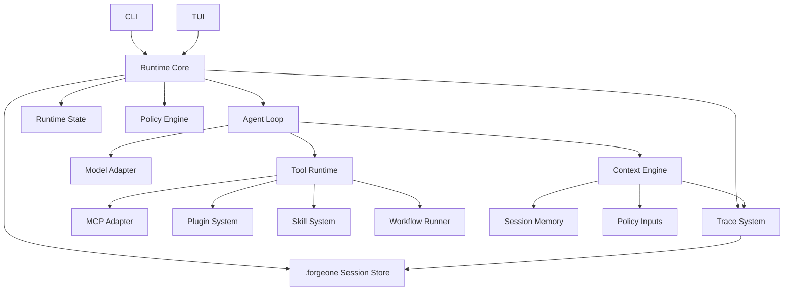
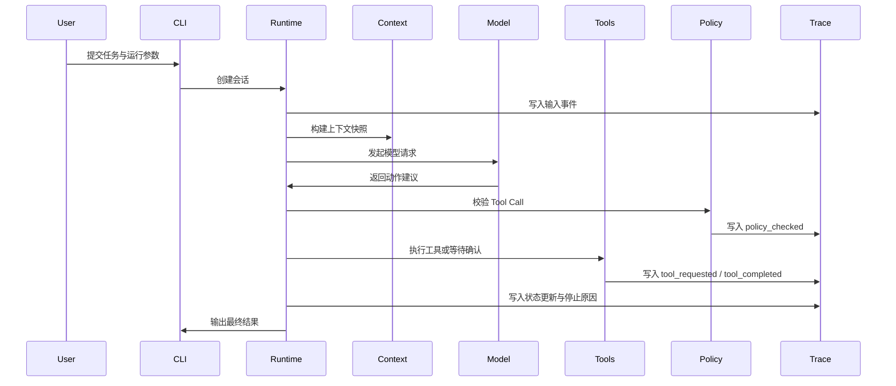

# ForgeOne Architecture

## 总览

ForgeOne 采用分层架构，将交互入口、运行时内核、上下文系统、工具系统、策略系统和观测系统解耦。

它不是 LangGraph 之上的上层应用，也不是把工具调用塞进 prompt 的轻量封装；ForgeOne 的重点是定义一个独立的 Agent Runtime。

当前仓库中的实际 crate 边界如下：

- `forgeone-cli`
- `forgeone-runtime`
- `forgeone-context`
- `forgeone-model`
- `forgeone-model-openai`
- `forgeone-model-ollama`
- `forgeone-tools`
- `forgeone-policy`
- `forgeone-trace`
- `forgeone-tui`

## 模块划分

### CLI

CLI 是面向终端用户和自动化脚本的主入口，负责：

- 接收任务输入
- 解析运行参数
- 启动或恢复会话
- 渲染结构化输出
- 导出 Trace 和运行结果

当前已实现命令包括：

- `run`
- `approve`
- `resume`
- `trace list/show/prune`
- `session list/prune`

CLI 不负责实现 Agent 智能，只负责将用户意图转交给 Harness 和 Runtime。

### TUI

TUI 提供交互式终端界面，用于展示：

- 当前 Agent Loop 阶段
- Context 构建结果
- Prompt 视图
- Tool 执行状态
- Runtime State 变化
- Trace 时间线

TUI 依赖 Runtime 提供的结构化事件流，而不是自行维护另一套执行逻辑。

当前仓库已经新增独立的 `forgeone-tui` crate，用于承载首版终端控制面骨架。它当前采用 mock dashboard 数据渲染，用于稳定布局、键位和可视调测路径，后续再接入真实 Session / Trace 数据源。

### Runtime Core

Runtime Core 是系统中枢，负责：

- 管理会话生命周期
- 保存 Runtime State
- 组装 Agent Loop
- 协调 Context、Model、Tool、Policy、Trace 子系统
- 处理中断、恢复、失败和终止

当前代码中，Runtime Core 还负责：

- 写入 `.forgeone/traces/<session_id>.json`
- 写入 `.forgeone/sessions/<session_id>.json`
- 在 `waiting_approval` 状态与 `approve/resume` CLI 之间建立恢复点

Runtime Core 应保持模型无关、工具无关和前端无关。

### Agent Loop

Agent Loop 是 Runtime 的执行状态机，负责把一次任务推进为若干轮离散步骤，包括输入接收、上下文构建、模型调用、工具决策、工具执行、观察吸收和停止判断。

Loop 必须可观测、可中断、可限次，并具有明确的停止条件。

当前实现已支持：

- 多轮 Context -> Model -> Tool -> Observation 闭环
- Model Response 驱动下一步 Tool Decision
- Tool 执行后进入下一轮，而不是单轮固定结束
- 命中确认门槛时进入 `waiting_approval`

### Context Engine

Context Engine 负责生成当前轮次的上下文快照，输入可能包括：

- 用户任务
- 会话历史
- Policy 注入
- Tool 观察结果
- 系统提示模板

Context Engine 的输出不仅是最终 Prompt，也包括中间构建产物及其来源。

### Tool Runtime

Tool Runtime 负责统一管理工具注册、权限控制、参数校验、执行隔离、超时处理和结果标准化。

Tool Runtime 的职责不只是“调用函数”，还包括：

- 追踪 Tool Call
- 注入审计信息
- 应用预算和并发控制
- 处理失败语义和重试策略

当前最小实现已包含：

- `ToolRegistry`
- `ToolCallRequest`
- `ToolCallResult`
- `Observation`
- 内建 `read_file`

### MCP Adapter

MCP Adapter 负责将外部 MCP 能力映射为 ForgeOne 的标准 Tool 能力，统一纳入权限、Trace 和状态系统。

MCP 不应绕过 Tool Runtime 直接接入模型。

### Plugin System

Plugin System 提供较粗粒度的扩展机制，适合增加工具包、上下文提供器、策略钩子、输出处理器和执行器集成。

Plugin 需要经过版本声明、能力注册和权限边界声明。

### Skill System

Skill System 提供面向任务模式的轻量能力组合，适合表达：

- 某类仓库的任务模板
- 特定工作流的上下文补充规则
- 若干工具与策略的推荐组合

Skill 不替代 Runtime，只在 Runtime 允许的边界内增强任务表现。

### Policy Engine

Policy Engine 负责在执行前和执行中施加约束，例如：

- 工具白名单
- 路径访问限制
- 沙箱模式
- Token / 时间 / 金额预算
- 最大循环次数
- 人工确认门槛

Policy Engine 的决策应作为结构化事件写入 Trace。

当前代码中已经落地的策略包括：

- `allowed_tools`
- `read_roots`
- `approval_read_roots`
- `max_tool_calls`

### Trace System

Trace System 负责记录：

- 输入事件
- Context 构建事件
- Prompt 生成事件
- 模型请求与响应摘要
- Tool Call 请求与结果
- Runtime State 变化
- Stop Condition 命中原因

当前实现已将以下事件拆成独立 Trace：

- `policy_checked`
- `tool_requested`
- `tool_completed`

Trace 不等于普通日志。它必须支持重放、检索、比对和导出。

### Session Store

当前 Runtime 使用 `.forgeone/` 目录保存本地控制面数据：

- `.forgeone/traces/<session_id>.json`
- `.forgeone/sessions/<session_id>.json`

其中：

- `traces/` 用于 `trace list/show/prune`
- `sessions/` 用于 `waiting_approval`、`approve`、`resume`

## 数据流

## 设计约束

- 所有执行路径都必须经过 Runtime Core
- 所有外部能力都必须经过 Tool Runtime
- 所有上下文都必须可以解释来源
- 所有关键决策都必须进入 Trace
- 所有安全与预算约束都必须由 Policy Engine 统一执行
- 所有本地恢复点都必须通过 Runtime State 与 `.forgeone` Session Store 统一管理
