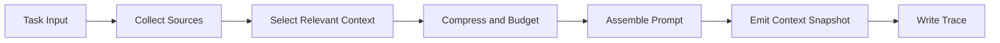

# ForgeOne Context Engine

## 目标

Context Engine 负责把离散输入整合成一份可解释的上下文快照，用于驱动模型请求与 Runtime 决策。

ForgeOne 将 Context 视为一等运行时对象，而不是简单的 prompt 拼接结果。上下文必须透明、可裁剪、可追踪、可重建。

当前实现中的 Context Engine 已经落地为独立 crate，并围绕“防多轮爆炸”设计：

- `ContextSource`
- `SelectedSegment`
- `CompressionEvent`
- `ContextLayer`
- `ContextLayerState`
- `PromptMessage`
- `ContextSnapshot`
- `WorkingMemory`
- `WorkingSet`
- `ObservationSummary`
- `ContextBudget`

但对 ForgeOne 而言，`Context Engine` 的目标不只是“避免超长 prompt”，而是主动控制模型焦点，降低注意力漂移。透明性本身不是终点，透明性是 Runtime 自动重建上下文的前提。

## 设计原则

- 上下文来源可追踪
- 裁剪策略可解释
- 上下文构建与 Prompt 生成分离
- Policy 注入显式化
- Trace 全量保留，Context 只保当前工作集
- 上下文接近上限时优先自动压缩与重建，而不是直接停止会话
- `overflow` 只应被视为异常，不应成为用户常见路径

## 焦点控制目标

ForgeOne 做上下文透明，不是为了在失败时解释“为什么停了”，而是为了在运行中持续回答这些问题：

- 当前轮真正的任务焦点是什么
- 哪些信息仍然影响下一步决策
- 哪些内容只是审计记录，不应继续占用活跃上下文
- 哪些历史已经完成，应从工作集退出
- 哪些 observation 正在稀释模型注意力

因此，Context Engine 本质上应是 `focus-preserving context controller`，而不是被动的 prompt assembler。

## 分层上下文模型

当前 Context Engine 已开始向四层结构收敛：

### Goal Anchor

长期稳定的任务锚点，通常包含：

- 用户目标
- 关键约束
- 不可丢失的任务前提

当前已实际承载：

- `task_input`
- `system_prompt`
- `policy_injection`

这一层默认高优先级，不应轻易压缩。

### Working Set

当前轮最相关的活跃工作集，通常包含：

- 当前正在处理的文件、对象或子任务
- 当前决策必须依赖的上下文片段
- 当前尚未完成的执行线索

当前已实际承载：

- `working_memory`
- `working_set`

这一层是模型注意力的主要承载区。

### Evidence Buffer

最近仍有决策价值的证据缓冲区，通常包含：

- 最近一到两轮的关键 observation
- 最近关键工具调用的摘要
- 近期失败原因或约束变化

当前已实际承载：

- 最近两条 `tool_observation`

这一层可以合并、摘要或降级，但不应无限扩张。

### Archive Summary

旧历史、已完成阶段和审计信息的摘要层，通常包含：

- 已完成事项摘要
- 老轮次对话或工具结果的阶段摘要
- 仅为连续性保留的背景信息

当前已实际承载：

- 最近历史
- `older_history_summary`
- `older_observation_summary`

这一层默认不保留原文，优先以摘要形式存在。

## 输入来源

Context Engine 可以消费以下输入：

- 用户任务与附加约束
- 会话历史
- 工具观察结果
- 系统级提示模板
- Policy Engine 注入规则
- Skill / Workflow 提供的上下文片段

当前代码中已实际接入的来源包括：

- `task_input`
- `session_history`
- `tool_observation`
- `system_prompt`
- `policy_injection`
- `working_memory`
- `working_set`

当前实现中，这些来源已经开始被分配到 `Goal Anchor / Working Set / Evidence Buffer / Archive Summary` 四层，而不是继续按来源类型平铺进入 Prompt。

## 核心组件

### Context Source

定义上下文来源类型，例如任务输入、仓库文件、工具结果、策略规则、技能补充等。

### Context Selector

根据任务目标、预算和相关性选择上下文候选片段。

当前实现为简单规则：

- `task_input` 必选
- `system_prompt` 必选
- `working_memory` 必选
- 最近历史保留少量
- 最近 observation 保留少量

后续这一步不应只做“选几个片段”，还应显式回答：

- 这个片段属于哪一层
- 它是在保焦点，还是只在维持连续性
- 它是否可以在下一轮退入 `Archive Summary`

### Context Compressor

当上下文接近预算上限时，对片段进行摘要、截断、聚合、降级或替换。

当前实现已落地：

- `truncate`
- 面向 source 类型的 budget 分层
- 老历史合并摘要
- 老 observation 合并摘要

当前尚未落地：

- 模型摘要
- 复杂语义聚合

但后续正确方向不是“超限就停”，而是自动执行多级压缩链。推荐顺序：

1. 去重重复 observation
2. 合并同类工具结果
3. 摘要旧历史
4. 摘要已完成阶段
5. 缩减低价值工具描述注入
6. 缩减低优先级 policy/context
7. 收缩 Working Set 到最小可执行范围
8. 必要时按任务阶段重建 Prompt

只有在多级压缩后仍无法保留最小有效任务上下文时，才应暴露异常。

### Prompt Assembler

把结构化上下文对象组装为模型请求可接受的消息格式，同时保留来源引用。

当前实现会按优先级把片段组装为：

- `system` message
- `user` message

当前已经开始按上下文层组装：

- `Goal Anchor` -> `system`
- 其余三层 -> `user`

后续应继续演进为“按上下文层分配密度”，确保 `Goal Anchor` 和 `Working Set` 始终比 `Archive Summary` 更接近模型注意力中心。

### Context Trace

记录每个片段的来源、选择原因、裁剪过程、哈希摘要和预算占用。

当前实现中，Runtime 会把 `ContextSnapshot.summary()` 写入 `context_built` Trace 事件。

后续 Trace 不只应记录“压了多少”，还应记录：

- 哪些内容退出了活跃工作集
- 哪些内容被转入摘要层
- 哪些证据被判定为当前轮高相关
- 哪些上下文在保焦点过程中被丢弃

## 构建流程

## 透明性要求

ForgeOne 的上下文透明至少包括：

- 可以看到哪些信息来自工具观察
- 可以看到哪些内容是系统提示或策略注入
- 可以看到哪些片段被裁剪以及为什么被裁剪
- 可以看到最终 Prompt 由哪些片段构成
- 可以看到 Working Memory 如何影响当前轮上下文

## 多轮控制

多轮执行中的上下文控制遵循以下原则：

- Trace 保留全量事件
- Context Snapshot 每轮重建，不做无限追加
- Observation 以摘要形式回灌
- Working Memory 单独建模当前目标、已完成事项、待完成事项
- 老轮次历史只保留少量最近内容
- 接近窗口上限时优先自动压缩、自动重建，而不是直接停止

## 最小可执行上下文

ForgeOne 后续需要明确一个“最小可执行上下文”边界。至少应包含：

- `goal_anchor`
- `active_working_set`
- `recent_evidence`
- `operational_policy`
- `working_memory`

如果这组最小上下文都无法被保留，才说明 Runtime 已无法在保证任务正确性的前提下继续执行。

## Overflow 边界

在 ForgeOne 里，上下文超限不应被视为正常 `Stop Condition`。更合理的定义是：

- 正常路径：自动压缩与重建后继续执行
- 异常路径：多级压缩后仍无法保留最小可执行上下文

因此，`context overflow` 更接近 Runtime 缺陷、策略失败或 provider 窗口假设错误，而不是一个可接受的日常用户结果。

## 输出

Context Engine 的输出不应只是单一字符串。建议输出：

- `context_snapshot`
- `prompt_messages`
- `source_refs`
- `compression_events`
- `budget_estimate`

详见 [specs/context-spec.md](/root/project/ai/forgeone/specs/context-spec.md)。
