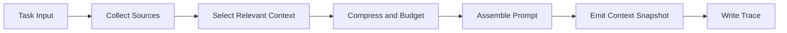

# ForgeOne Context Engine

## 目标

Context Engine 负责把离散输入整合成一份可解释的上下文快照，用于驱动模型请求与 Runtime 决策。

ForgeOne 将 Context 视为一等运行时对象，而不是简单的 prompt 拼接结果。上下文必须透明、可裁剪、可追踪、可重建。

当前实现中的 Context Engine 已经落地为独立 crate，并围绕“防多轮爆炸”设计：

- `ContextSource`
- `SelectedSegment`
- `CompressionEvent`
- `PromptMessage`
- `ContextSnapshot`
- `WorkingMemory`
- `ObservationSummary`
- `ContextBudget`

## 设计原则

- 上下文来源可追踪
- 裁剪策略可解释
- 上下文构建与 Prompt 生成分离
- Policy 注入显式化
- Trace 全量保留，Context 只保当前工作集

## 输入来源

Context Engine 可以消费以下输入：

- 用户任务与附加约束
- 会话历史
- 工具观察结果
- 系统级提示模板
- Policy Engine 注入规则
- Skill / Workflow 提供的上下文片段

当前代码中已实际接入的来源包括：

- `task_input`
- `session_history`
- `tool_observation`
- `system_prompt`
- `policy_injection`
- `working_memory`

## 核心组件

### Context Source

定义上下文来源类型，例如任务输入、仓库文件、工具结果、策略规则、技能补充等。

### Context Selector

根据任务目标、预算和相关性选择上下文候选片段。

当前实现为简单规则：

- `task_input` 必选
- `system_prompt` 必选
- `working_memory` 必选
- 最近历史保留少量
- 最近 observation 保留少量

### Context Compressor

当上下文超出预算时，对片段进行摘要、截断、聚合或替换。

当前实现已落地：

- `truncate`
- 面向 source 类型的 budget 分层

当前尚未落地：

- 模型摘要
- 复杂语义聚合

### Prompt Assembler

把结构化上下文对象组装为模型请求可接受的消息格式，同时保留来源引用。

当前实现会按优先级把片段组装为：

- `system` message
- `user` message

### Context Trace

记录每个片段的来源、选择原因、裁剪过程、哈希摘要和预算占用。

当前实现中，Runtime 会把 `ContextSnapshot.summary()` 写入 `context_built` Trace 事件。

## 构建流程

## 透明性要求

ForgeOne 的上下文透明至少包括：

- 可以看到哪些信息来自工具观察
- 可以看到哪些内容是系统提示或策略注入
- 可以看到哪些片段被裁剪以及为什么被裁剪
- 可以看到最终 Prompt 由哪些片段构成
- 可以看到 Working Memory 如何影响当前轮上下文

## 多轮控制

多轮执行中的上下文控制遵循以下原则：

- Trace 保留全量事件
- Context Snapshot 每轮重建，不做无限追加
- Observation 以摘要形式回灌
- Working Memory 单独建模当前目标、已完成事项、待完成事项
- 老轮次历史只保留少量最近内容

## 输出

Context Engine 的输出不应只是单一字符串。建议输出：

- `context_snapshot`
- `prompt_messages`
- `source_refs`
- `compression_events`
- `budget_estimate`

详见 [specs/context-spec.md](/root/project/ai/forgeone/specs/context-spec.md)。
