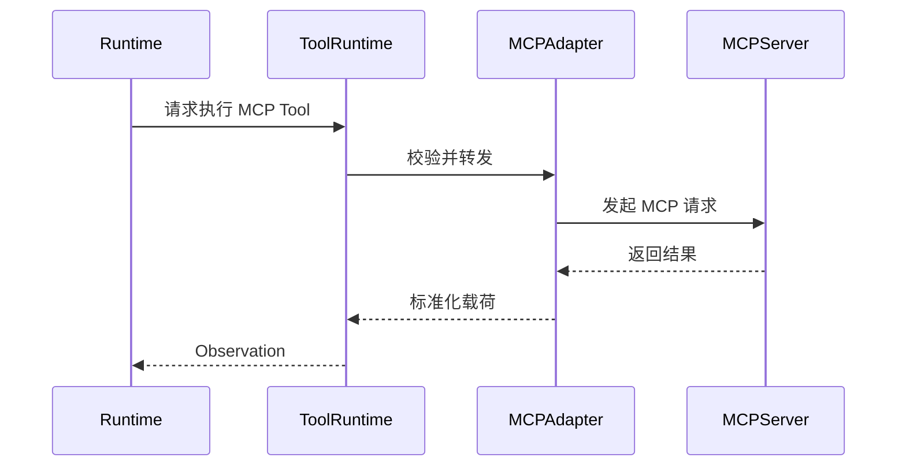

# ForgeOne MCP Integration

## 目标

ForgeOne 将 MCP 视为外部能力接入协议，而不是运行时本体。

MCP 的作用是把外部工具、资源和上下文能力接入 ForgeOne；ForgeOne 的作用是为这些能力提供统一的执行控制、权限模型和 Trace 能力。

## 集成原则

- MCP 能力通过 MCP Adapter 接入
- 接入后统一映射为 ForgeOne Tool 或 Context Provider
- 所有 MCP 调用必须进入 Trace
- 所有 MCP 调用必须经过 Policy Engine

## 适配层职责

MCP Adapter 负责：

- 建立与 MCP Server 的连接
- 拉取可用能力描述
- 映射到 ForgeOne 的工具与上下文协议
- 维护连接状态
- 处理认证、超时、失败与重连

## 运行模型

## 能力映射

MCP 接入后至少应映射出以下信息：

- 工具名称与描述
- 输入模式
- 输出模式
- 权限要求
- 资源消耗预估
- 可观测标识

## 当前落地边界

- 工作区通过 `.forgeone/mcp/*.json` 声明 MCP Provider 清单
- 当前已支持清单发现与 `forgeone mcp list`
- MCP Server 连接、认证、超时、重连和实际 Tool 调用尚未接入 Runtime 主链路
- 后续落地时，MCP 能力仍必须统一映射为标准 `Tool Descriptor` 与 `Tool Call`

## 风险控制

MCP Server 可能带来以下风险：

- 动态能力边界不清晰
- 外部网络依赖不稳定
- 认证状态过期
- 工具返回格式不一致

因此 ForgeOne 必须在 MCP Adapter 层进行约束和标准化，而不是直接把原始 MCP 响应暴露给模型。
