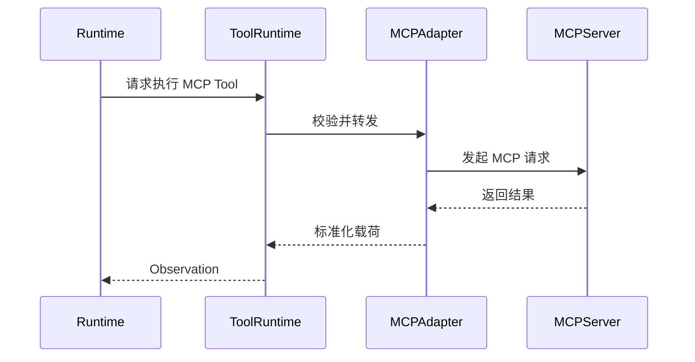

# ForgeOne MCP Integration

## 目标

ForgeOne 将 MCP 视为外部能力接入协议，而不是运行时本体。

MCP 的作用是把外部工具、资源和上下文能力接入 ForgeOne；ForgeOne 的作用是为这些能力提供统一的执行控制、权限模型和 Trace 能力。

## 集成原则

- MCP 能力通过 MCP Adapter 接入
- 接入后统一映射为 ForgeOne Tool 或 Context Provider
- 所有 MCP 调用必须进入 Trace
- 所有 MCP 调用必须经过 Policy Engine

## 适配层职责

MCP Adapter 负责：

- 建立与 MCP Server 的连接
- 拉取可用能力描述
- 映射到 ForgeOne 的工具与上下文协议
- 维护连接状态
- 处理认证、超时、失败与重连

## 运行模型

```mermaid
sequenceDiagram
    participant Runtime
    participant ToolRuntime
    participant MCPAdapter
    participant MCPServer

    Runtime->>ToolRuntime: 请求执行 MCP Tool
    ToolRuntime->>MCPAdapter: 校验并转发
    MCPAdapter->>MCPServer: 发起 MCP 请求
    MCPServer-->>MCPAdapter: 返回结果
    MCPAdapter-->>ToolRuntime: 标准化载荷
    ToolRuntime-->>Runtime: Observation
```

## 能力映射

MCP 接入后至少应映射出以下信息：

- 工具名称与描述
- 输入模式
- 输出模式
- 权限要求
- 资源消耗预估
- 可观测标识

## 当前落地边界

- MCP 支持**双级配置**：
  - 全局级（对所有项目生效）：`{user_home}/.forgeone/mcp/*.json`（Windows 为 `%USERPROFILE%\.forgeone\mcp\`）
  - 项目级（仅当前项目生效）：`{workspace}/.forgeone/mcp/*.json`
  - 同名 server 时**项目级覆盖全局级**；注册顺序为项目级优先、全局级兜底
- 配置清单格式：`api_version: forgeone/v1`、`kind: mcp`、`transport` 声明传输类型（`stdio` 用 `entrypoint`、`sse` 用 `endpoint`）
- Agent Loop 启动时自动发现并注册（幂等）：按传输类型建立连接 → `initialize` / `notifications/initialized` / `tools/list` 握手 → 以 `{server}__{tool}` 注册为 `ToolKind::Mcp` 工具，`inputSchema` 转发给 LLM（`crates/forgeone-runtime/src/mcp.rs`）
- 支持两类传输：
  - `stdio`：本地子进程（node / npx 等命令），Windows 用 `cmd /C` 兼容启动；常驻 reader 线程 + 单次请求-响应超时（默认 30s，可用 `timeout` 字段调整），server 挂起不会永久阻塞
  - `sse`：HTTP+SSE 站点（`endpoint` 填 http(s) 地址），客户端 `GET {endpoint}/sse` 建流、`POST` 发请求、响应经 SSE 返回；`endpoint`/`headers`/`timeout` 配置字段生效
- JSON-RPC 消息构造遵循规范：无参数时**省略 `params` 字段**而非显式 `null`（部分 MCP server 会拒绝/忽略 `params:null` 的请求，例如基于 SDK 校验的 server）
- MCP 工具调用走统一 Tool Call 链路：`ToolRegistry` 分发 → `McpExecutor` 转发 `tools/call` → 结构化结果进入 Observation
- 已验证：stdio 与 sse 两类传输、Windows `cmd /C` 进程兼容、幂等注册、子进程 Drop 回收、全局/项目双级与同名覆盖（见 `crates/forgeone-runtime/tests/mcp_integration.rs`、`tests/global_mcp.rs`、`tests/http_sse_mcp.rs`；测试用 mock server 在 `crates/forgeone-runtime/src/bin/mcp_mock_server.rs`，SSE mock 为 axum 本地服务）
- 桌面端提供 MCP 管理 REST 端点：`GET /api/mcp/servers`（列表，含 `scope` 与 `status`，未注册成功的 manifest 以 `failed` 展示）、`POST/DELETE /api/mcp/servers`（添加/删除，body 含 `scope: "global" | "project"`，删除时同步注销并回收子进程）、`GET /api/mcp/servers/detail`（配置 + 工具列表）、`POST /api/mcp/servers/reconnect`（failed → 重新注册，失败不删 manifest），设置页 McpTab 已按全局/项目分区块接入，支持展开详情与一键重连
- 尚未落地：streamable-http 传输（`endpoint` / `headers` 字段）、认证、超时与断线重连
- 注意：tauri 内置的 `mcp_server.rs` 实为 REST + SSE 服务（端口 9527），并非标准 MCP 协议端点，命名待后续收敛

## 风险控制

MCP Server 可能带来以下风险：

- 动态能力边界不清晰
- 外部网络依赖不稳定
- 认证状态过期
- 工具返回格式不一致

因此 ForgeOne 必须在 MCP Adapter 层进行约束和标准化，而不是直接把原始 MCP 响应暴露给模型。
