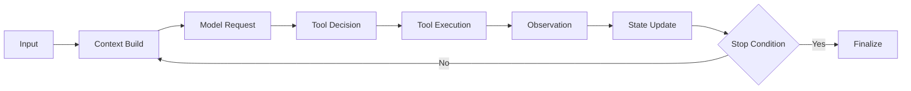

# ForgeOne Runtime

## 目标

ForgeOne Runtime 是一个面向 Agent Task 的执行系统。它负责把一次用户任务转换为可观测、可追踪、可控制的 Agent Loop。

ForgeOne 不依赖 LangGraph 作为执行核心。Loop 的状态机、上下文构建、工具语义和停止条件都由自研 Runtime 定义。

当前仓库中的 Runtime 已实现一条最小可运行链路：

- 单 Agent 多轮 Loop
- Context Build -> Model Request -> Tool Decision -> Tool Execution -> Observation -> State Update
- Policy Engine 控制工具白名单、路径读权限、确认门槛
- `waiting_approval` 状态与 `approve/resume` CLI 控制
- `.forgeone/traces` 与 `.forgeone/sessions` 的本地持久化

## Agent Loop

一次标准 Agent Loop 包含以下阶段：

## 阶段说明

### Input

输入阶段负责接收：

- 用户任务文本
- 附加参数
- 会话恢复标识
- 权限与沙箱配置
- 预算与循环上限
- 工具可用性约束

该阶段会产生首个 Runtime State，并写入输入事件。

### Context Build

Context Build 阶段负责构建当前轮次所需的上下文快照。其输入包括：

- 当前任务
- 历史消息与观察结果
- Policy 注入信息
- 选定 Skill / Workflow 的额外上下文规则

输出应包括：

- 可发送给模型的 Prompt 片段集合
- 来源元数据
- 裁剪记录
- 预算消耗估算

### Model Request

Runtime 将上下文快照提交给模型适配层，发起一次结构化请求。该请求至少应包含：

- 系统层提示
- 任务层提示
- 上下文片段
- 工具描述摘要
- 当前策略约束

Prompt 必须可追踪，且可以在 Trace 中查看构成来源。

### Tool Decision

模型返回后，Runtime 需要判断下一步动作：

- 直接输出结果
- 请求一个或多个工具
- 请求澄清
- 结束任务
- 命中策略阻断

该决策不能只由模型文本决定，必须结合 Policy Engine 和 Runtime State。

### Tool Execution

当下一步为工具调用时，Tool Runtime 负责：

- 校验工具是否已注册
- 校验权限、沙箱、预算和参数
- 执行工具
- 处理超时、失败和取消
- 记录结构化结果

工具执行后，结果不会直接拼接为纯文本，而是作为 Observation 注入后续循环。

### Observation

Observation 阶段负责吸收工具输出和外部事件，并将其标准化为 Runtime 可消费的观察对象，例如：

- shell 命令输出摘要
- 文件 diff
- MCP 响应
- 插件返回对象

Observation 既服务于模型下一轮决策，也服务于 Trace 和调试。

### State Update

State Update 负责更新：

- 当前轮次编号
- 累积 Token 与时间预算
- 已执行工具列表
- 最近一次观察结果
- 中间产物引用
- 错误状态与恢复点

Runtime State 更新必须是显式且可检查的。

### Stop Condition

Loop 的结束条件至少包括：

- 模型明确给出最终结果
- 达到最大循环次数
- 达到预算上限
- 命中策略终止规则
- 命中确认门槛并进入 `waiting_approval`
- 用户中断
- 不可恢复的工具或模型错误

停止原因必须被结构化记录，而不是只输出一句自然语言说明。

## Runtime State

Runtime State 建议至少包含以下字段：

- `session_id`
- `task_id`
- `loop_index`
- `status`
- `active_model_request`
- `active_tool_call`
- `budget_usage`
- `observations`
- `pending_approval`
- `active_context_snapshot`
- `policy_decisions`
- `stop_reason`

当前实现还额外持有 `agent_id`、`last_model_response`、`last_tool_result` 等字段，用于支持 Trace、恢复与审批链路。

详见 [specs/runtime-spec.md](/root/project/ai/forgeone/specs/runtime-spec.md)。

## 执行约束

- Loop 必须支持最大轮次控制
- 工具执行必须受权限和沙箱策略约束
- 上下文构建必须可追踪
- 模型请求必须具备可审计的输入视图
- 任何外部扩展都不能绕过 Runtime State 和 Trace
- 会话控制必须保留 `waiting_approval`、`approve`、`resume` 等受控恢复入口
