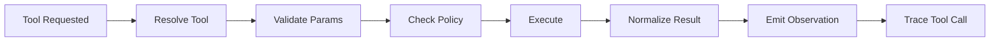

# ForgeOne Tool Runtime

## 目标

Tool Runtime 负责统一管理 Agent 可调用能力，包括本地工具、MCP 工具、插件工具、技能触发器以及工作流执行器。

它的目标不是提供一个“工具列表”，而是提供一套具备权限、审计、预算和失败语义的执行基础设施。

当前仓库已落地一个最小实现：

- `ToolRegistry`
- `ToolCallRequest`
- `ToolCallResult`
- `Observation`
- 内建 `read_file`
- Tool Execution 前统一走 `Policy Engine`
- `tool_requested / policy_checked / tool_completed` Trace 事件

## 设计要求

- Tool Call 可追踪
- 参数模式可验证
- 权限边界可声明
- 沙箱模式可配置
- 执行结果可标准化
- 失败语义可区分

## 生命周期

## Tool 类型

### Built-in Tool

由 ForgeOne 内建，典型示例包括：

- 文件读取
- 文件写入
- 补丁应用
- shell 执行

当前代码中已实现的内建 Tool 为：

- `read_file`

### MCP Tool

由 MCP Server 暴露，经 MCP Adapter 注册到 Tool Runtime。

### Plugin Tool

由插件提供，适合封装领域能力或外部服务集成。

### Skill-backed Tool

由 Skill 触发的高层任务能力，但最终仍需落到标准 Tool 语义。

### Workflow Tool

封装多步执行流程，适合表达重复性较高的任务模式。

## 权限模型

每个 Tool 应定义最小权限边界，至少包括：

- 可访问路径范围
- 是否允许网络访问
- 是否允许执行子进程
- 资源预算限制
- 是否需要人工确认

当前实现中，`read_file` 的实际控制由 Policy Engine 负责：

- 工具白名单
- 路径前缀限制
- 最大 Tool Call 次数
- 命中确认根路径时返回 `RequireApproval`

## 返回结果模型

Tool Runtime 应统一返回以下结构信息：

- 执行状态
- 结构化载荷
- 错误对象
- 完成时间

当前实现的 `ToolCallResult` 已包含：

- `call_id`
- `status`
- `structured_output`
- `error`
- `completed_at_ms`

## 失败语义

Tool 失败至少应区分：

- 参数错误
- 权限拒绝
- 外部依赖失败
- 不可恢复内部错误

不同失败类型将影响 Runtime 的恢复策略和停止决策。

## Trace 集成

每次 Tool Call 应进入 Trace，包括：

- 调用前上下文
- 调用参数摘要
- 权限判定结果
- 执行耗时
- 结果摘要
- 失败类别

当前实现已经拆分为：

- `tool_requested`
- `policy_checked`
- `tool_completed`

若命中确认门槛，则不会立即进入 `tool_completed`，而是先写入：

- `policy_checked decision=require_approval`
- `session_stopped status=waiting_approval`

详见 [specs/tool-spec.md](/root/project/ai/forgeone/specs/tool-spec.md)。
